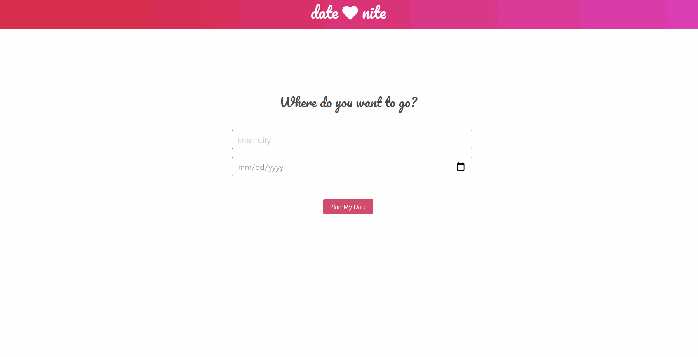

## DATE NITE: A One-Click Solution to Planning Dates

### URL: https://darnocer.github.io/Project-01-Date-Nite-App/

## Description

Date Nite is a one-click solution to planning dates! Simply enter where and when (if you know), and let Date Nite return the top bars, restaurants, and events near you!

## Usage

- Enter the city (required) and the planned date (optional)
- Click "Plan My Date" to get options for your date

- See top Restaurants, Bars, and Events in the area
- See the weather forecast if date is within 5 days

- If no date entered, or date is beyond the 5 day forecast, "Weather data not available" is returned

## Technologies

- [jQuery](https://jquery.com/)
- **CSS Framework:** [Bulma](http:www.bulma.io)
- **Restaurants & Bars:** [Google Places API](https://cloud.google.com/maps-platform/places/?utm_source=google&utm_medium=cpc&utm_campaign=FY18-Q2-global-demandgen-paidsearchonnetworkhouseads-cs-maps_contactsal_saf&utm_content=text-ad-none-none-DEV_c-CRE_433476780145-ADGP_Hybrid+%7C+AW+SEM+%7C+BKWS+~+Google+Maps+Places+API-KWID_43700039136946099-kwd-22859391737-userloc_9028777&utm_term=KW_google%20places%20api-ST_google+places+api&gclid=CjwKCAjwt-L2BRA_EiwAacX32cTHR4EAZhNlEPeRxT_o4BOFoJvOw7T8TY0_ZBDw3UEOReAuOZhQsBoC1egQAvD_BwE)
- **Events:** [TicketMaster API](https://developer.ticketmaster.com/products-and-docs/apis/getting-started/)
- **Weather:** [OpenWeatherMap API](https://openweathermap.org/api)

## Future Development

- add a footer
- add stars for rating
- add Jokes API for date one-liners
- base the event results on user-inputted date _(There is currently a lack of events due to COVID-19 so we are returning all events in an area)_

## Contributors

- **HTML/CSS**: Darian Nocera 
- **Ticket Master API**: Mouad Kharbach 

- **Google Places API**: Brandon Formby 
