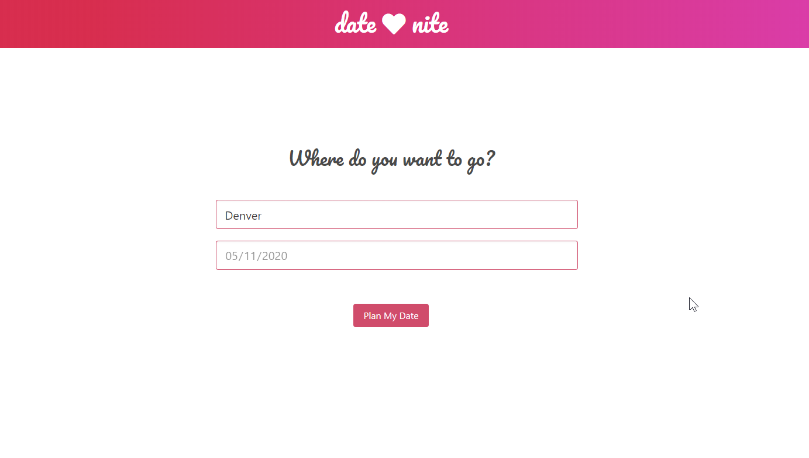
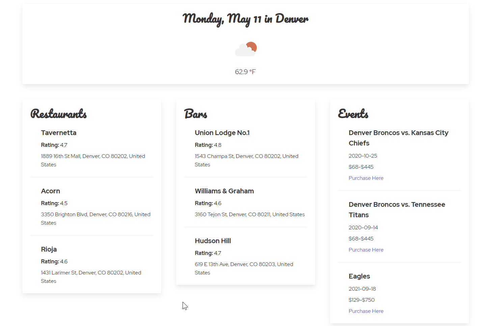

# Project 1: Date Nite App

## DATE NITE: A One-Click solution to planning dates

- Enter the city (required) and the planned date (optional)
- Click "Plan My Date" to get options for your date

- See top Restaurants, Bars, and Events in the area
- See the weather forecast if date is within 5 days

- If no date entered, or date is beyond the 5 day forecast, "Weather data not available" is returned

## Technologies

- CSS Framework: [Bulma](http:www.bulma.io)
- jQuery
- Restaurants & Bars: Google Places API
- Events: TicketMaster API
- Weather: OpenWeatherMap API

## Future Dev

- add a footer
- add stars for rating
- add Jokes API for date one-liners
- base the event results on user-inputted date (Currently lack of events due to COVID-19)

## Application Requirements

### Directives for this project included the following requirements:

- Must use at least two server-side APIs
- Must use a CSS framework _other than_ Bootstrap
- Must be interactive (i.e: accept and respond to user input)
- Use at least one new third-party API
- Must have a polished UI
- Must meet good quality coding standards
- Does not use alerts, confirms or prompts (look into _modals_)
- Must be deployed to GitHub Pages
